# BLoC/Cubit Usage Guide

**Version:** 1.0
**Last Updated:** November 2025

---

## Table of Contents

1. [Overview](#overview)
2. [BLoC vs Cubit](#bloc-vs-cubit)
3. [Basic Cubit Architecture](#basic-cubit-architecture)
4. [State Management Flow](#state-management-flow)
5. [Cubit Hierarchy in the App](#cubit-hierarchy-in-the-app)
6. [Common Usage Patterns](#common-usage-patterns)
7. [Sequence Diagrams](#sequence-diagrams)
8. [Presentation Events Pattern](#presentation-events-pattern)
9. [Cross-Cubit Communication](#cross-cubit-communication)
10. [Best Practices](#best-practices)
11. [Testing Cubits](#testing-cubits)
12. [Common Pitfalls](#common-pitfalls)

---

## Overview

This app uses the **BLoC (Business Logic Component)** pattern with **Cubit** for state management. Cubit is a simplified version of BLoC that removes the need for events, making it easier to use while maintaining all the benefits of the BLoC pattern.

### Why BLoC/Cubit?

- **Separation of Concerns:** Business logic is separated from UI
- **Testability:** Easy to test business logic without UI
- **Predictability:** Unidirectional data flow
- **Reusability:** Business logic can be shared across screens
- **Debugging:** Time-travel debugging with bloc_observer
- **Performance:** Selective widget rebuilds

### Key Packages

```yaml
dependencies:
  bloc: ^8.1.2                    # Core BLoC library
  flutter_bloc: ^8.1.3            # Flutter integration
  bloc_presentation: ^1.0.0       # Presentation events (one-time events)
```

---

## BLoC vs Cubit

### Traditional BLoC

```dart
// Event
abstract class CounterEvent {}
class IncrementEvent extends CounterEvent {}

// BLoC
class CounterBloc extends Bloc<CounterEvent, int> {
  CounterBloc() : super(0) {
    on<IncrementEvent>((event, emit) {
      emit(state + 1);
    });
  }
}

// Usage
context.read<CounterBloc>().add(IncrementEvent());
```

### Cubit (Simplified)

```dart
// No events needed!
class CounterCubit extends Cubit<int> {
  CounterCubit() : super(0);

  void increment() {
    emit(state + 1);
  }
}

// Usage - direct method call
context.read<CounterCubit>().increment();
```

### Why We Chose Cubit

| Feature | BLoC | Cubit | Winner |
|---------|------|-------|--------|
| Boilerplate | High (events + handlers) | Low (just methods) | Cubit |
| Type Safety | Event classes | Method parameters | Equal |
| Debugging | Event stream visible | Direct method calls | BLoC |
| Learning Curve | Steeper | Gentler | Cubit |
| Event Replay | Built-in | Requires custom code | BLoC |
| Use Case | Complex flows, event sourcing | Most UI cases | Depends |

**Our Decision:** Cubit for most cases, full BLoC if we need event replay or complex event handling.

---

## Basic Cubit Architecture

### Anatomy of a Cubit

```dart
// 1. State Class (Immutable)
class PlayerState {
  final AppRadio? selectedRadio;
  final bool isPlaying;
  final bool isLoading;

  const PlayerState({
    this.selectedRadio,
    required this.isPlaying,
    required this.isLoading,
  });

  // copyWith for immutable updates
  PlayerState copyWith({
    AppRadio? selectedRadio,
    bool? isPlaying,
    bool? isLoading,
  }) {
    return PlayerState(
      selectedRadio: selectedRadio ?? this.selectedRadio,
      isPlaying: isPlaying ?? this.isPlaying,
      isLoading: isLoading ?? this.isLoading,
    );
  }
}

// 2. Cubit Class
class PlayerCubit extends Cubit<PlayerState> {
  final AudioHandler _audioHandler;

  // Constructor: initialize with default state
  PlayerCubit(this._audioHandler)
      : super(const PlayerState(
          isPlaying: false,
          isLoading: false,
        ));

  // Public methods (like events in traditional BLoC)
  Future<void> play() async {
    emit(state.copyWith(isLoading: true));

    try {
      await _audioHandler.play();
      emit(state.copyWith(
        isPlaying: true,
        isLoading: false,
      ));
    } catch (e) {
      emit(state.copyWith(isLoading: false));
      // Handle error
    }
  }

  void pause() {
    _audioHandler.pause();
    emit(state.copyWith(isPlaying: false));
  }

  void selectRadio(AppRadio radio) {
    emit(state.copyWith(selectedRadio: radio));
    play();
  }

  @override
  Future<void> close() {
    // Cleanup resources
    return super.close();
  }
}
```

### State Immutability

**Why Immutable?**
- Predictable state changes
- Easy debugging (can compare old vs new state)
- Time-travel debugging
- No accidental mutations

**Pattern:**
```dart
// Bad - Mutable state
class BadState {
  AppRadio? radio;
  bool isPlaying = false;
}

// Good - Immutable state
class GoodState {
  final AppRadio? radio;
  final bool isPlaying;

  const GoodState({this.radio, required this.isPlaying});

  GoodState copyWith({AppRadio? radio, bool? isPlaying}) {
    return GoodState(
      radio: radio ?? this.radio,
      isPlaying: isPlaying ?? this.isPlaying,
    );
  }
}
```

---

## State Management Flow

### Basic Flow Diagram

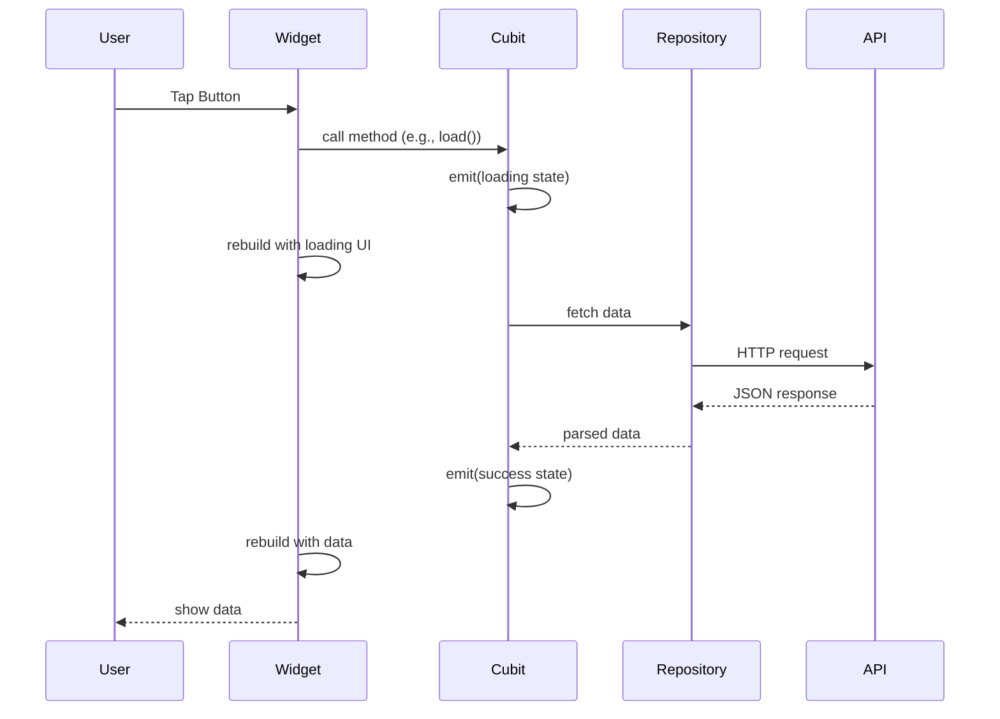

### Detailed Example: Loading Radio Stations

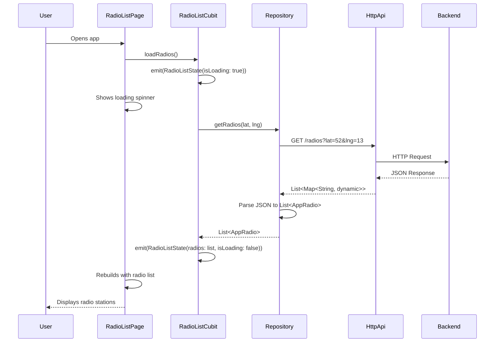

---

## Cubit Hierarchy in the App

### Scope-Based Organization

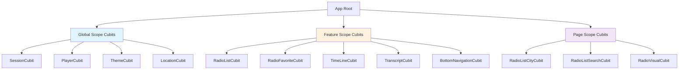

### 1. Global Scope Cubits

Created in `main.dart`, available throughout the app:

**File:** `lib/main.dart`

```dart
MultiBlocProvider(
  providers: [
    BlocProvider(
      create: (_) => SessionCubit(repository),
    ),
    BlocProvider(
      create: (_) => PlayerCubit(audioHandler),
    ),
    BlocProvider(
      create: (_) => ThemeCubit(),
    ),
    BlocProvider(
      create: (_) => LocationCubit(),
    ),
  ],
  child: App(...),
)
```

| Cubit | Responsibility | Lifetime |
|-------|---------------|----------|
| `SessionCubit` | User authentication, device registration | App lifetime |
| `PlayerCubit` | Audio playback state and controls | App lifetime |
| `ThemeCubit` | Dark/light theme management | App lifetime |
| `LocationCubit` | GPS permissions and coordinates | App lifetime |

### 2. Feature Scope Cubits

Created in `AppScope`, available to feature pages:

**File:** `lib/app/app_scope.dart`

```dart
MultiBlocProvider(
  providers: [
    BlocProvider(
      create: (context) => RadioListCubit(
        context.read<SessionCubit>(),
        repository,
      ),
    ),
    BlocProvider(
      create: (context) => RadioFavoriteCubit(repository),
    ),
    BlocProvider(
      create: (context) => TimeLineCubit(repository),
    ),
    BlocProvider(
      create: (context) => TranscriptCubit(repository),
    ),
    BlocProvider(
      create: (_) => BottomNavigationCubit(),
    ),
  ],
  child: child,
)
```

| Cubit | Responsibility | Lifetime |
|-------|---------------|----------|
| `RadioListCubit` | Main station list management | Feature lifetime |
| `RadioFavoriteCubit` | Favorite stations management | Feature lifetime |
| `TimeLineCubit` | EPG program schedule | Feature lifetime |
| `TranscriptCubit` | Live transcription management | Feature lifetime |
| `BottomNavigationCubit` | Bottom nav state | Feature lifetime |

### 3. Page Scope Cubits

Created per-route for specific pages:

**File:** `lib/app/router.dart`

```dart
GoRoute(
  path: '/city',
  builder: (context, state) {
    return BlocProvider(
      create: (context) => RadioListCityCubit(
        context.read<Repository>(),
      ),
      child: RadioListCityPage(),
    );
  },
)
```

| Cubit | Responsibility | Lifetime |
|-------|---------------|----------|
| `RadioListCityCubit` | City-filtered stations | Page lifetime |
| `RadioListSearchCubit` | Station search | Page lifetime |
| `RadioVisualCubit` | Audio visualization | Page lifetime |

---

## Common Usage Patterns

### 1. Read Without Listening (Actions)

Use when you need to **trigger an action** but don't need to rebuild when state changes:

```dart
// In widget
ElevatedButton(
  onPressed: () {
    // Just call the method, don't listen to state
    context.read<PlayerCubit>().play();
  },
  child: Text('Play'),
)
```

**When to use:**
- Button onPressed callbacks
- Triggering actions from initState
- One-time operations

### 2. Watch Entire State

Use when you need to rebuild on **any state change**:

```dart
// In widget build method
final state = context.watch<PlayerCubit>().state;

if (state.isLoading) {
  return LoadingIndicator();
}

if (state.isPlaying) {
  return PauseButton();
}

return PlayButton();
```

**When to use:**
- Simple widgets
- When you need multiple state properties
- When all state changes should trigger rebuild

### 3. Select Specific Property (Optimized)

Use when you only care about **specific state changes**:

```dart
// Only rebuilds when isPlaying changes
final isPlaying = context.select((PlayerCubit c) => c.state.isPlaying);

return IconButton(
  icon: Icon(isPlaying ? Icons.pause : Icons.play_arrow),
  onPressed: () {
    context.read<PlayerCubit>().play();
  },
);
```

**Performance Impact:**

```dart
// Bad - rebuilds on ANY PlayerState change
final state = context.watch<PlayerCubit>().state;
Text(state.selectedRadio?.name ?? '');

// Good - only rebuilds when selectedRadio changes
final radioName = context.select(
  (PlayerCubit c) => c.state.selectedRadio?.name,
);
Text(radioName ?? '');
```

**Benchmark:** Using `select` can reduce rebuilds by 70-90% in complex screens.

### 4. BlocBuilder (Full Control)

Use when you need **builder pattern with conditions**:

```dart
BlocBuilder<PlayerCubit, PlayerState>(
  // Optional: only rebuild when condition is true
  buildWhen: (previous, current) {
    return previous.isPlaying != current.isPlaying;
  },
  builder: (context, state) {
    if (state.isLoading) {
      return CircularProgressIndicator();
    }

    if (state.selectedRadio == null) {
      return Text('No station selected');
    }

    return PlayerControls(radio: state.selectedRadio!);
  },
)
```

**When to use:**
- Complex UI logic
- Conditional rebuilds (buildWhen)
- Multiple state checks

### 5. BlocListener (Side Effects)

Use for **side effects** without rebuilding:

```dart
BlocListener<SessionCubit, SessionState>(
  listener: (context, state) {
    // Navigation
    if (state.isLoggedOut) {
      context.go('/login');
    }

    // Dialogs
    if (state.error != null) {
      showDialog(
        context: context,
        builder: (_) => ErrorDialog(state.error!),
      );
    }

    // Snackbars
    if (state.message != null) {
      ScaffoldMessenger.of(context).showSnackBar(
        SnackBar(content: Text(state.message!)),
      );
    }
  },
  child: YourWidget(),
)
```

**When to use:**
- Navigation
- Showing dialogs/snackbars
- Analytics tracking
- Any side effect that doesn't require UI rebuild

### 6. BlocConsumer (Builder + Listener)

Combines BlocBuilder and BlocListener:

```dart
BlocConsumer<RadioListCubit, RadioListState>(
  listener: (context, state) {
    // Side effects
    if (state.error != null) {
      showErrorSnackbar(context, state.error!);
    }
  },
  builder: (context, state) {
    // UI rendering
    if (state.isLoading) {
      return LoadingIndicator();
    }

    return RadioList(radios: state.radios);
  },
)
```

**When to use:**
- Need both UI rebuild AND side effects
- Avoids nesting BlocBuilder inside BlocListener

---

## Sequence Diagrams

### 1. Basic User Interaction

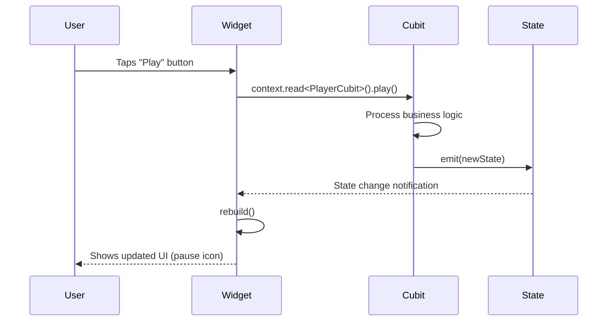

### 2. Complex Feature Flow: Playing a Radio Station

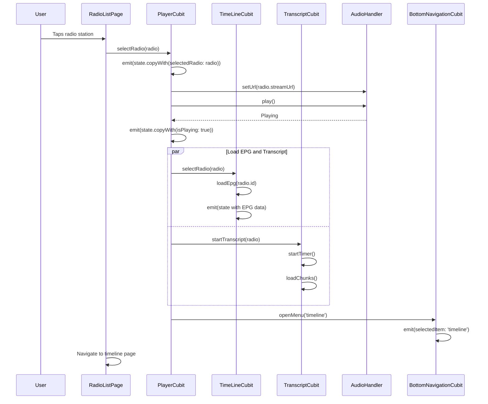

### 3. State Update Flow with Multiple Listeners

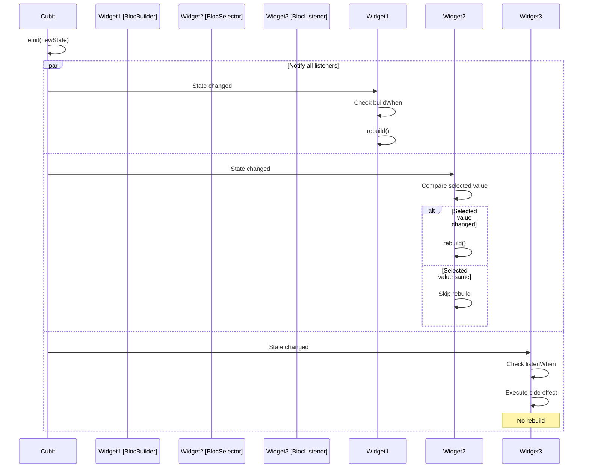

### 4. Data Loading with Error Handling

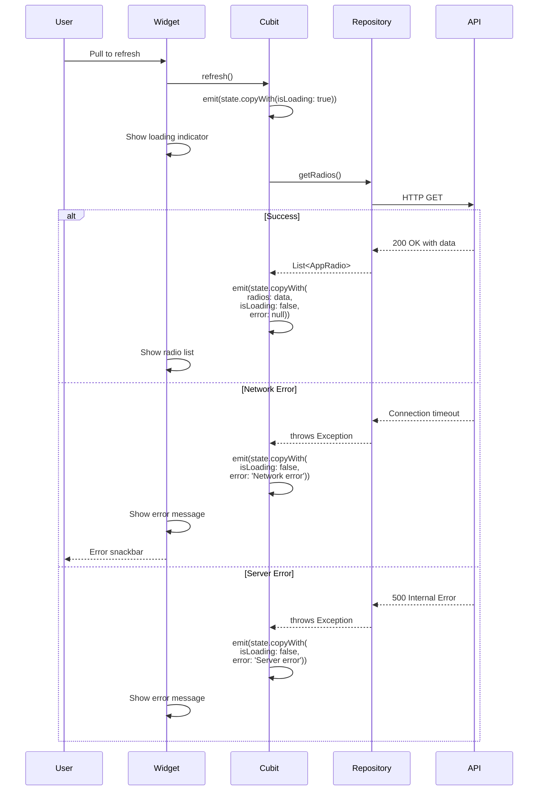

### 5. Dependency Injection and Initialization

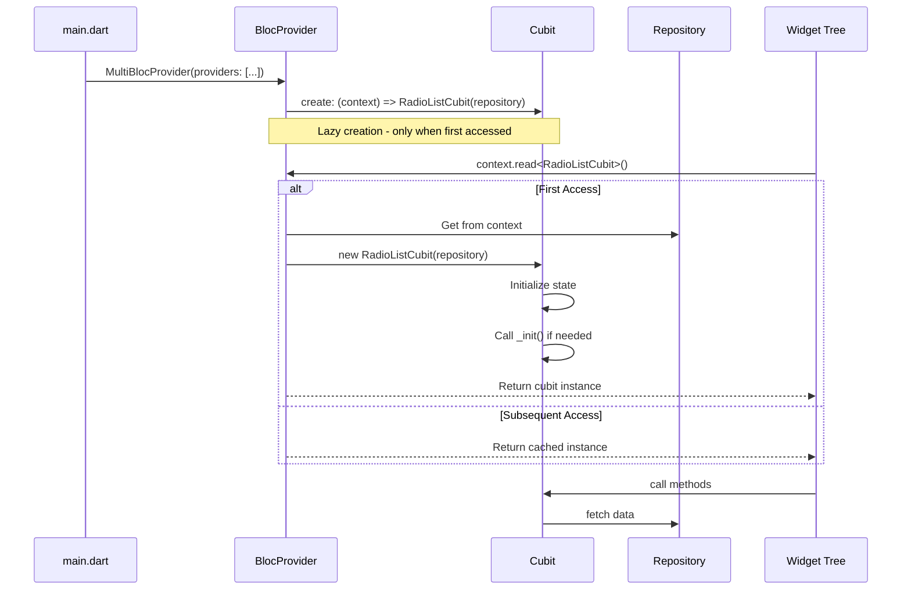

---

## Presentation Events Pattern

### Problem: One-Time Events

State is for **continuous** values (isLoading, selectedRadio), but some things should happen **once**:
- Navigation
- Showing dialogs
- Displaying snackbars/toasts
- Error alerts

**Problem with state-based approach:**

```dart
// Bad - State-based error handling
class RadioListState {
  final String? error;
}

// In UI:
BlocListener<RadioListCubit, RadioListState>(
  listener: (context, state) {
    if (state.error != null) {
      showDialog(...); // Shows dialog every rebuild!
    }
  },
)
```

**Issues:**
- Dialog shows multiple times
- Hard to clear error (need to emit state again)
- State pollution with one-time values

### Solution: Presentation Events

Use `bloc_presentation` package for one-time events:

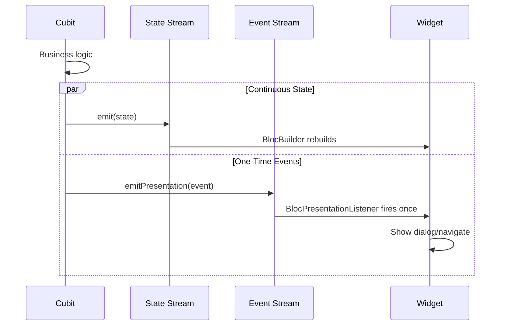

### Implementation

**Step 1: Define Events**

```dart
// lib/features/radio_list/cubit/radio_list_event.dart

abstract class RadioListEvent {}

class RadioListErrorEvent extends RadioListEvent {
  final String message;
  RadioListErrorEvent(this.message);
}

class RadioListSuccessEvent extends RadioListEvent {
  final String message;
  RadioListSuccessEvent(this.message);
}

class RadioListNavigateEvent extends RadioListEvent {
  final String route;
  RadioListNavigateEvent(this.route);
}
```

**Step 2: Cubit with Presentation Mixin**

```dart
// lib/features/radio_list/cubit/radio_list_cubit.dart

class RadioListCubit extends Cubit<RadioListState>
    with BlocPresentationMixin<RadioListState, RadioListEvent> {

  final Repository _repository;

  RadioListCubit(this._repository) : super(RadioListState.initial());

  Future<void> loadRadios() async {
    emit(state.copyWith(isLoading: true));

    try {
      final radios = await _repository.getRadios();
      emit(state.copyWith(
        radios: radios,
        isLoading: false,
      ));

      // One-time success event
      emitPresentation(RadioListSuccessEvent('Loaded ${radios.length} stations'));

    } catch (e) {
      emit(state.copyWith(isLoading: false));

      // One-time error event
      emitPresentation(RadioListErrorEvent('Failed to load stations'));
    }
  }

  Future<void> addToFavorites(AppRadio radio) async {
    try {
      await _repository.addFavorite(radio.id);

      // Success toast
      emitPresentation(RadioListSuccessEvent('Added to favorites'));

    } catch (e) {
      emitPresentation(RadioListErrorEvent('Failed to add favorite'));
    }
  }
}
```

**Step 3: Listen to Events in UI**

```dart
// In widget:

BlocPresentationListener<RadioListCubit, RadioListEvent>(
  listener: (context, event) {
    if (event is RadioListErrorEvent) {
      // Show error dialog (only once!)
      showDialog(
        context: context,
        builder: (_) => AlertDialog(
          title: Text('Error'),
          content: Text(event.message),
          actions: [
            TextButton(
              onPressed: () => Navigator.pop(context),
              child: Text('OK'),
            ),
          ],
        ),
      );
    } else if (event is RadioListSuccessEvent) {
      // Show success toast (only once!)
      toastification.show(
        context: context,
        title: Text(event.message),
        type: ToastificationType.success,
        autoCloseDuration: Duration(seconds: 3),
      );
    } else if (event is RadioListNavigateEvent) {
      // Navigate (only once!)
      context.go(event.route);
    }
  },
  child: BlocBuilder<RadioListCubit, RadioListState>(
    builder: (context, state) {
      // Regular UI rendering based on state
      if (state.isLoading) {
        return LoadingIndicator();
      }

      return RadioList(radios: state.radios);
    },
  ),
)
```

### Flow Diagram

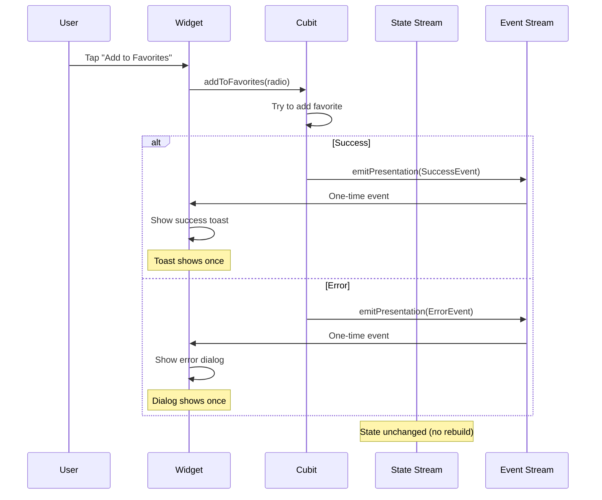

---

## Cross-Cubit Communication

### Pattern 1: Direct Dependency Injection

When one cubit needs to access another:

```dart
class RadioListCubit extends Cubit<RadioListState> {
  final Repository _repository;
  final SessionCubit _sessionCubit;  // Dependency on another cubit

  RadioListCubit(this._repository, this._sessionCubit)
      : super(RadioListState.initial()) {
    _init();
  }

  void _init() {
    // Access other cubit's state
    final userId = _sessionCubit.state.user?.id;
    if (userId != null) {
      loadPersonalizedRadios(userId);
    }
  }

  Future<void> loadPersonalizedRadios(String userId) async {
    // Use user data from SessionCubit
    final radios = await _repository.getRadiosForUser(userId);
    emit(state.copyWith(radios: radios));
  }
}
```

**Creation:**

```dart
BlocProvider(
  create: (context) => RadioListCubit(
    context.read<Repository>(),
    context.read<SessionCubit>(),  // Inject SessionCubit
  ),
  child: RadioListPage(),
)
```

**Flow:**

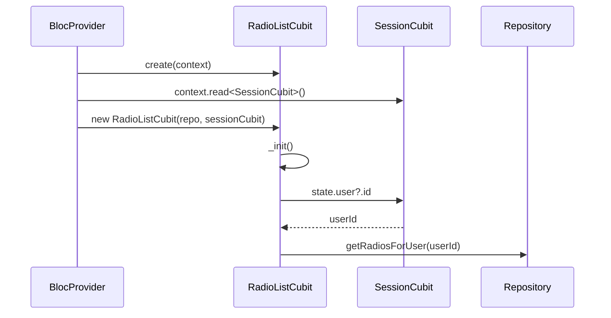

### Pattern 2: Listening to Other Cubits

**File:** `lib/app/global_cubit_connection.dart`

Use BlocListener to react to changes in other cubits:

```dart
class GlobalCubitConnection extends StatelessWidget {
  final Widget child;

  const GlobalCubitConnection({required this.child});

  @override
  Widget build(BuildContext context) {
    return MultiBlocListener(
      listeners: [
        // Listen to LocationCubit and update RadioListCubit
        BlocPresentationListener<LocationCubit, LocationEvent>(
          listener: (context, event) {
            if (event is LocationChanged) {
              // Reload radios when location changes
              context.read<RadioListCubit>().loadRadios(
                lat: event.position.latitude,
                lng: event.position.longitude,
              );
            }
          },
        ),

        // Listen to PlayerCubit and update TimeLineCubit
        BlocListener<PlayerCubit, PlayerState>(
          listenWhen: (previous, current) {
            return previous.selectedRadio?.id != current.selectedRadio?.id;
          },
          listener: (context, state) {
            if (state.selectedRadio != null) {
              // Load timeline when radio changes
              context.read<TimeLineCubit>().selectRadio(state.selectedRadio!);

              // Start transcript
              context.read<TranscriptCubit>().startTranscript(state.selectedRadio!);
            }
          },
        ),

        // Listen to SessionCubit for logout
        BlocPresentationListener<SessionCubit, SessionEvent>(
          listener: (context, event) {
            if (event is SessionLogoutEvent) {
              // Clear all feature state on logout
              context.read<RadioListCubit>().clear();
              context.read<RadioFavoriteCubit>().clear();
              context.read<PlayerCubit>().stop();

              // Navigate to login
              context.go('/login');
            }
          },
        ),
      ],
      child: child,
    );
  }
}
```

**Flow Diagram:**

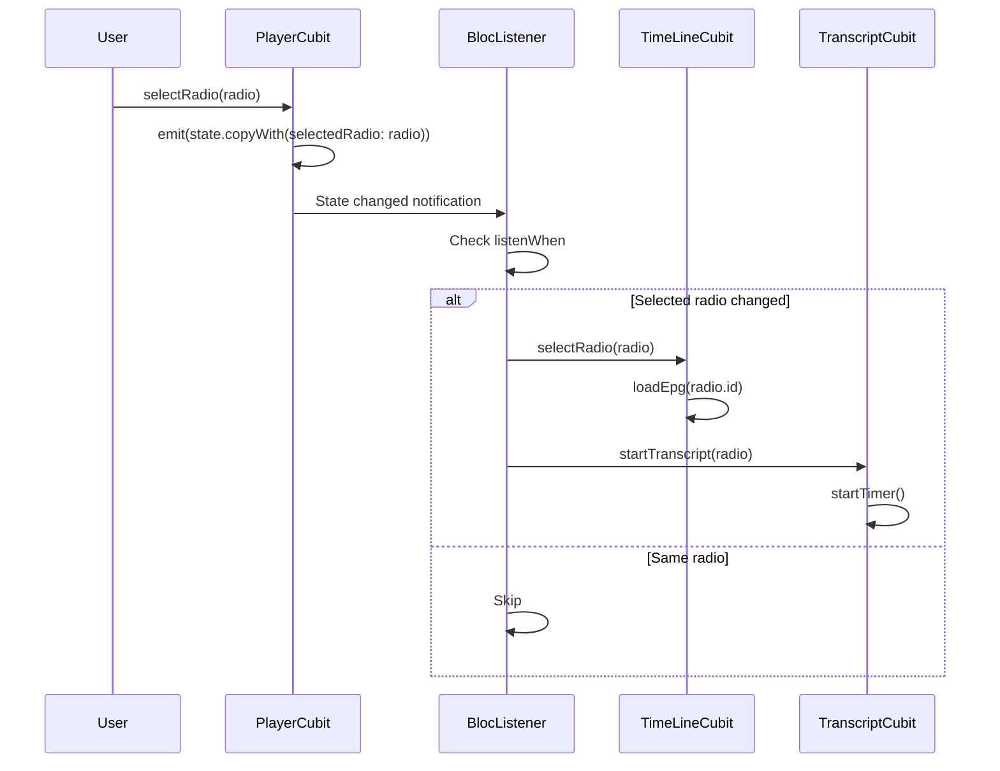

### Pattern 3: Shared State via Repository

For loosely coupled cubits, share data via repository:

```dart
// Repository acts as shared data source
class Repository {
  final HttpApi _api;

  // Cache shared between cubits
  List<AppRadio>? _cachedRadios;

  Future<List<AppRadio>> getRadios() async {
    if (_cachedRadios != null) {
      return _cachedRadios!;
    }

    final radios = await _api.get('/radios', ...);
    _cachedRadios = radios;
    return radios;
  }

  void clearCache() {
    _cachedRadios = null;
  }
}

// Both cubits use same repository
class RadioListCubit extends Cubit<RadioListState> {
  final Repository _repository;

  Future<void> load() async {
    final radios = await _repository.getRadios(); // Uses cache
    emit(state.copyWith(radios: radios));
  }
}

class RadioSearchCubit extends Cubit<RadioSearchState> {
  final Repository _repository;

  Future<void> search(String query) async {
    final radios = await _repository.getRadios(); // Uses same cache
    final filtered = radios.where((r) => r.name.contains(query)).toList();
    emit(state.copyWith(results: filtered));
  }
}
```

---

## Best Practices

### 1. State Design

**DO:**
```dart
// ✅ Immutable state with const constructor
class PlayerState {
  final AppRadio? selectedRadio;
  final bool isPlaying;

  const PlayerState({
    this.selectedRadio,
    required this.isPlaying,
  });

  PlayerState copyWith({...}) { ... }
}
```

**DON'T:**
```dart
// ❌ Mutable state
class PlayerState {
  AppRadio? selectedRadio;
  bool isPlaying = false;
}
```

### 2. Cubit Methods

**DO:**
```dart
// ✅ Descriptive method names (verbs)
class RadioListCubit extends Cubit<RadioListState> {
  Future<void> loadRadios() async { ... }
  Future<void> refreshRadios() async { ... }
  void selectRadio(AppRadio radio) { ... }
  void clearSelection() { ... }
}
```

**DON'T:**
```dart
// ❌ Vague method names
class RadioListCubit extends Cubit<RadioListState> {
  void update(dynamic data) { ... }
  void handle(String type) { ... }
  void process() { ... }
}
```

### 3. Error Handling

**DO:**
```dart
// ✅ Proper error handling with presentation events
Future<void> loadRadios() async {
  emit(state.copyWith(isLoading: true, error: null));

  try {
    final radios = await _repository.getRadios();
    emit(state.copyWith(
      radios: radios,
      isLoading: false,
    ));
  } on NetworkException catch (e) {
    emit(state.copyWith(isLoading: false));
    emitPresentation(RadioListErrorEvent('No internet connection'));
  } on ServerException catch (e) {
    emit(state.copyWith(isLoading: false));
    emitPresentation(RadioListErrorEvent('Server error: ${e.message}'));
  } catch (e) {
    emit(state.copyWith(isLoading: false));
    emitPresentation(RadioListErrorEvent('Unknown error occurred'));
  }
}
```

**DON'T:**
```dart
// ❌ Swallowing errors
Future<void> loadRadios() async {
  try {
    final radios = await _repository.getRadios();
    emit(state.copyWith(radios: radios));
  } catch (e) {
    // Silent failure - bad UX!
  }
}
```

### 4. Resource Cleanup

**DO:**
```dart
// ✅ Clean up resources in close()
class TranscriptCubit extends Cubit<TranscriptState> {
  Timer? _timer;

  void startTranscript() {
    _timer = Timer.periodic(Duration(seconds: 1), (_) {
      _loadNextChunk();
    });
  }

  @override
  Future<void> close() {
    _timer?.cancel();
    return super.close();
  }
}
```

**DON'T:**
```dart
// ❌ Forgetting to clean up
class TranscriptCubit extends Cubit<TranscriptState> {
  Timer? _timer;

  void startTranscript() {
    _timer = Timer.periodic(Duration(seconds: 1), (_) {
      _loadNextChunk();
    });
  }

  // No cleanup - timer keeps running!
}
```

### 5. Widget Rebuilds

**DO:**
```dart
// ✅ Use select for specific properties
final radioName = context.select(
  (PlayerCubit c) => c.state.selectedRadio?.name,
);

final isPlaying = context.select(
  (PlayerCubit c) => c.state.isPlaying,
);

// Only rebuilds when these specific values change
```

**DON'T:**
```dart
// ❌ Watch entire state unnecessarily
final state = context.watch<PlayerCubit>().state;
final radioName = state.selectedRadio?.name;

// Rebuilds on ANY state change (isLoading, isFavorite, etc.)
```

### 6. Initial State

**DO:**
```dart
// ✅ Named constructor for clarity
class RadioListState {
  final List<AppRadio> radios;
  final bool isLoading;
  final String? error;

  const RadioListState({
    required this.radios,
    required this.isLoading,
    this.error,
  });

  factory RadioListState.initial() {
    return const RadioListState(
      radios: [],
      isLoading: false,
      error: null,
    );
  }

  RadioListState copyWith({...}) { ... }
}

// Usage:
class RadioListCubit extends Cubit<RadioListState> {
  RadioListCubit() : super(RadioListState.initial());
}
```

**DON'T:**
```dart
// ❌ Magic values in constructor
class RadioListCubit extends Cubit<RadioListState> {
  RadioListCubit() : super(RadioListState([], false, null));
  // What do these values mean?
}
```

### 7. Dependency Injection

**DO:**
```dart
// ✅ Inject all dependencies
class RadioListCubit extends Cubit<RadioListState> {
  final Repository _repository;
  final LocationCubit _locationCubit;

  RadioListCubit(
    this._repository,
    this._locationCubit,
  ) : super(RadioListState.initial());
}

// Easy to test:
test('loads radios', () {
  final mockRepo = MockRepository();
  final mockLocation = MockLocationCubit();
  final cubit = RadioListCubit(mockRepo, mockLocation);

  // Test...
});
```

**DON'T:**
```dart
// ❌ Hard-coded dependencies
class RadioListCubit extends Cubit<RadioListState> {
  final repository = Repository(); // Hard to test!

  RadioListCubit() : super(RadioListState.initial());
}
```

### 8. Async Operations

**DO:**
```dart
// ✅ Check if closed before emitting after async
Future<void> loadRadios() async {
  if (isClosed) return; // Early return if cubit closed

  emit(state.copyWith(isLoading: true));

  try {
    final radios = await _repository.getRadios();

    if (isClosed) return; // Check again after async

    emit(state.copyWith(
      radios: radios,
      isLoading: false,
    ));
  } catch (e) {
    if (isClosed) return;

    emit(state.copyWith(isLoading: false));
    emitPresentation(RadioListErrorEvent(e.toString()));
  }
}
```

**DON'T:**
```dart
// ❌ Emitting after cubit is closed
Future<void> loadRadios() async {
  emit(state.copyWith(isLoading: true));

  final radios = await _repository.getRadios();

  // Cubit might be closed if user navigated away!
  emit(state.copyWith(radios: radios)); // Can throw error
}
```

---

## Testing Cubits

### Unit Testing Setup

```dart
// test/features/radio_list/cubit/radio_list_cubit_test.dart

import 'package:bloc_test/bloc_test.dart';
import 'package:flutter_test/flutter_test.dart';
import 'package:mocktail/mocktail.dart';

// Mock dependencies
class MockRepository extends Mock implements Repository {}
class MockSessionCubit extends Mock implements SessionCubit {}

void main() {
  group('RadioListCubit', () {
    late Repository repository;
    late SessionCubit sessionCubit;
    late RadioListCubit cubit;

    setUp(() {
      repository = MockRepository();
      sessionCubit = MockSessionCubit();
      cubit = RadioListCubit(repository, sessionCubit);
    });

    tearDown(() {
      cubit.close();
    });

    test('initial state is correct', () {
      expect(
        cubit.state,
        equals(RadioListState.initial()),
      );
    });

    blocTest<RadioListCubit, RadioListState>(
      'emits [loading, success] when loadRadios succeeds',
      build: () {
        when(() => repository.getRadios()).thenAnswer(
          (_) async => [
            AppRadio(id: '1', name: 'Test Radio'),
          ],
        );
        return cubit;
      },
      act: (cubit) => cubit.loadRadios(),
      expect: () => [
        RadioListState(
          radios: [],
          isLoading: true,
          error: null,
        ),
        RadioListState(
          radios: [AppRadio(id: '1', name: 'Test Radio')],
          isLoading: false,
          error: null,
        ),
      ],
      verify: (_) {
        verify(() => repository.getRadios()).called(1);
      },
    );

    blocTest<RadioListCubit, RadioListState>(
      'emits [loading, error] when loadRadios fails',
      build: () {
        when(() => repository.getRadios()).thenThrow(
          Exception('Network error'),
        );
        return cubit;
      },
      act: (cubit) => cubit.loadRadios(),
      expect: () => [
        RadioListState(radios: [], isLoading: true, error: null),
        RadioListState(radios: [], isLoading: false, error: null),
      ],
      errors: () => [], // Presentation events are emitted, not errors
    );
  });
}
```

### Testing Presentation Events

```dart
blocTest<RadioListCubit, RadioListState>(
  'emits error event when loadRadios fails',
  build: () {
    when(() => repository.getRadios()).thenThrow(
      NetworkException('No connection'),
    );
    return cubit;
  },
  act: (cubit) => cubit.loadRadios(),
  expect: () => [
    RadioListState(radios: [], isLoading: true),
    RadioListState(radios: [], isLoading: false),
  ],
  verify: (_) {
    // Verify presentation event was emitted
    // (requires custom test helper)
    expect(
      cubit.presentationStream,
      emits(isA<RadioListErrorEvent>()),
    );
  },
);
```

### Integration Testing

```dart
testWidgets('loads and displays radios', (tester) async {
  // Setup
  final repository = MockRepository();
  when(() => repository.getRadios()).thenAnswer(
    (_) async => [
      AppRadio(id: '1', name: 'Test Radio'),
    ],
  );

  // Build widget tree
  await tester.pumpWidget(
    MaterialApp(
      home: BlocProvider(
        create: (_) => RadioListCubit(repository)..loadRadios(),
        child: RadioListPage(),
      ),
    ),
  );

  // Verify loading state
  expect(find.byType(CircularProgressIndicator), findsOneWidget);

  // Wait for async operation
  await tester.pumpAndSettle();

  // Verify data loaded
  expect(find.text('Test Radio'), findsOneWidget);
});
```

---

## Common Pitfalls

### 1. Emitting After Close

**Problem:**
```dart
Future<void> loadData() async {
  final data = await _repository.getData();
  emit(state.copyWith(data: data)); // Error if cubit closed!
}
```

**Solution:**
```dart
Future<void> loadData() async {
  final data = await _repository.getData();
  if (!isClosed) {
    emit(state.copyWith(data: data));
  }
}
```

### 2. Forgetting copyWith

**Problem:**
```dart
void selectRadio(AppRadio radio) {
  state.selectedRadio = radio; // Error: state is immutable!
  emit(state);
}
```

**Solution:**
```dart
void selectRadio(AppRadio radio) {
  emit(state.copyWith(selectedRadio: radio));
}
```

### 3. Not Cleaning Up Resources

**Problem:**
```dart
class TimerCubit extends Cubit<int> {
  late Timer _timer;

  TimerCubit() : super(0) {
    _timer = Timer.periodic(Duration(seconds: 1), (_) {
      emit(state + 1);
    });
  }
  // Timer never cancelled!
}
```

**Solution:**
```dart
@override
Future<void> close() {
  _timer.cancel();
  return super.close();
}
```

### 4. Multiple Emits in Sync Method

**Problem:**
```dart
void updateData(Data data) {
  emit(state.copyWith(isLoading: true));
  // Process data synchronously
  emit(state.copyWith(data: data, isLoading: false));
  // Only last emit is visible to UI!
}
```

**Solution:**
```dart
Future<void> updateData(Data data) async {
  emit(state.copyWith(isLoading: true));
  await Future.delayed(Duration.zero); // Yield to event loop
  emit(state.copyWith(data: data, isLoading: false));
}
```

### 5. Circular Dependencies

**Problem:**
```dart
class CubitA extends Cubit<StateA> {
  final CubitB cubitB;
  CubitA(this.cubitB) : super(StateA());
}

class CubitB extends Cubit<StateB> {
  final CubitA cubitA;
  CubitB(this.cubitA) : super(StateB());
}
// Can't instantiate either!
```

**Solution:** Use BlocListener for communication:
```dart
BlocListener<CubitA, StateA>(
  listener: (context, state) {
    context.read<CubitB>().handleAChange(state);
  },
)
```

### 6. Overusing context.watch

**Problem:**
```dart
@override
Widget build(BuildContext context) {
  final state = context.watch<HugeCubit>().state;

  // Only need one field, but rebuilds on ANY state change
  return Text(state.title);
}
```

**Solution:**
```dart
@override
Widget build(BuildContext context) {
  // Only rebuilds when title changes
  final title = context.select((HugeCubit c) => c.state.title);
  return Text(title);
}
```

---

## Summary

### Key Takeaways

1. **Cubit is simpler than BLoC** - Use Cubit for most cases, full BLoC only when needed
2. **State is immutable** - Always use `copyWith` for state updates
3. **Use `context.select`** - Optimize rebuilds by selecting specific state properties
4. **Presentation events for one-time actions** - Dialogs, navigation, toasts
5. **Clean up resources** - Always override `close()` if using timers, streams, etc.
6. **Test your cubits** - Unit tests are easy and valuable
7. **Inject dependencies** - Makes testing and maintenance easier

### Quick Reference

| Task | Pattern |
|------|---------|
| Trigger action | `context.read<C>().method()` |
| Rebuild on all changes | `context.watch<C>()` |
| Rebuild on specific change | `context.select((C c) => c.state.field)` |
| Side effects (no rebuild) | `BlocListener` |
| Rebuild + side effects | `BlocConsumer` |
| One-time events | `BlocPresentationListener` |
| Listen to other cubit | `BlocListener<OtherCubit>` |
| Clean up | Override `close()` |

---

**For more information:**
- [BLoC Documentation](https://bloclibrary.dev/)
- [Architecture Overview](architecture.md)
- [bloc_presentation Package](https://pub.dev/packages/bloc_presentation)

**Version History:**

| Version | Date | Changes |
|---------|------|---------|
| 1.0 | Nov 2025 | Initial BLoC/Cubit usage documentation |
